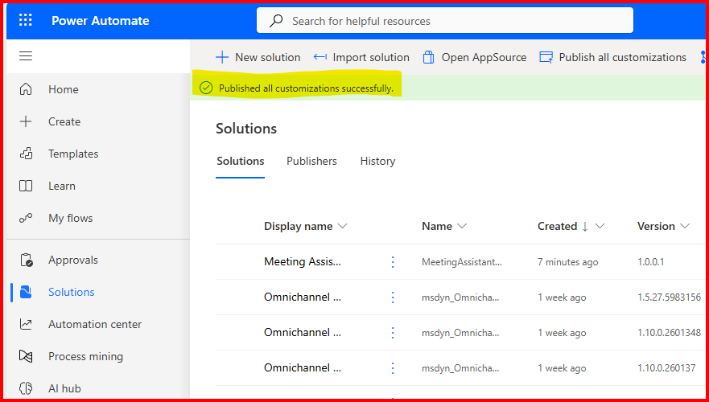
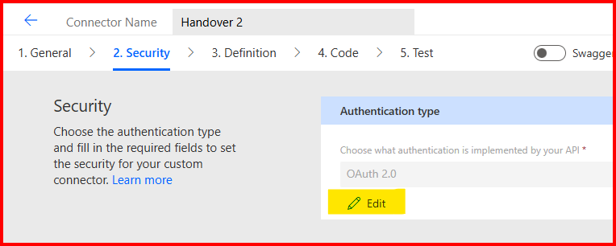
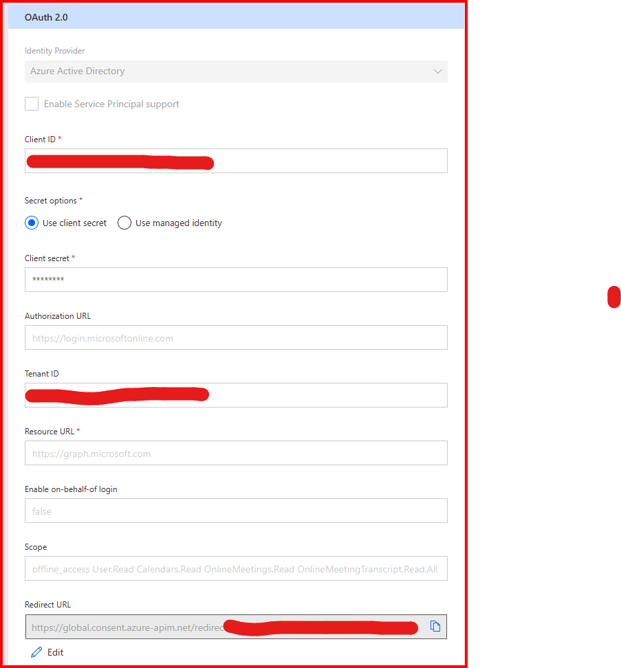
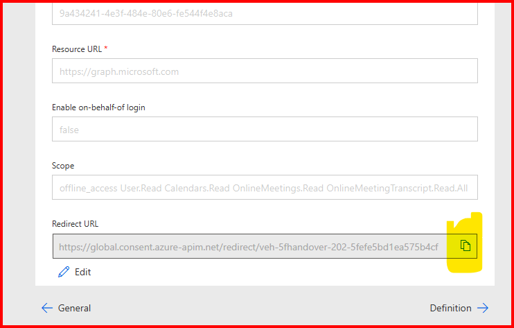
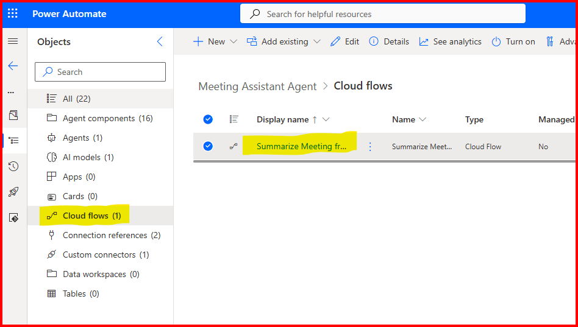

# Installation Guide

## Table of Contents
- [Solution Overview](../#overview)
- [Requirements for Installation](requirements-for-installation.md) 
- [Installation Guide](installation-guide.md)
- [How To Use This Agent](how-to-use-this-agent.md)

### Create an App Registration in Azure
First create an app registration in Azure.

1. Navigate to portal.azure.com
2. From the search bar, type "App Registrations" and click on the result.
3. Click on "New Registration"
4. For the "The user-facing display name for this application (this can be changed later)." , type in "Meeting Assistant Agent Registration". Leave the rest of the default items and click "Register".
5. Click on "Certificates and secrets"
6. Click "New client secret"
7. For Description enter "Meeting Assistant Agent". For Expires select "730 days".
8. From the resulting created secret, copy and paste to a notepad the "Value". Do NOT copy the "Secret ID".
9. From the left-menu click "API Permissions". Click "Add a permission". Click "Microsoft Graph". Click "Delegated permissions". 
10. In "Select permissions", type in Calendars.Read, select the entry and click "Add permissions".
11. Repeat the for the following:
- offline_access
- OnlineMeetings.Read
- OnlineMeetingTranscript.Read.All
12. Make sure to "Grand admin consent" for each item. The result should look like below:

Leave this tab open in your browser as you will have to come back to this configuration at the end of [Edit the Custom Connector](#edit-the-custom-connector).

### Download the Solution
Download the solution from the latest release: https://github.com/v7herman4/Meeting-Assistant-Agent/releases

Make sure the download the file matching "MeetingAssistantAgent_x_x_x_x.zip"

### Import the Solution
In a Power Platform compatible browser where you are signed in to your work account, in a new tab, navigate to make.powerautomate.com

Select the file "MeetingAssistantAgent_x_x_x_x.zip" from the location where you've downloaded it and click through the UI until the import beings.

Wait until the banner at the top of the page notes that the solution has finished importing.

Please note: you may get a "imported successfully with warnings" message. This is normal and will be mitigated in subsequent steps.

Click "Publish All Customizations". This step is mandatory.

Once "Publishing all customizations" completes, edit the custom connector.

### Edit the Custom Connector

Click the "Meeting Assistant Agent" solution to open the solution.

Click "Custom connectors (1)", click the triple-dots next to "Handover 2" and click "edit".

Click on "Edit" to edit the connector configuration

From the "General information" screen, click "Security ->" on the bottom right to go to the Security screen.

Click "Edit" to edit the authentication configuration.

Make sure the "Authentication type" at the top of the screen is set to "OAuth 2.0".

On the form "OAuth 2.0" below, set the following values as noted:

1. Identity Provider: Azure Active Directory
2. Enable Service Principal support: leave unchecked
3. Client ID: use the client id created in the section [Create an App Registration in Azure](#create-an-app-registration-in-azure)
4. Secret options: Use client secret
5. Client secret: use the client secret created in the section [Create an App Registration in Azure](#create-an-app-registration-in-azure)
6. Authorization URL: https://login.microsoftonline.com
7. Tenant ID: use the tenant id from the app registration created in the section [Create an App Registration in Azure](#create-an-app-registration-in-azure)
8. Resource URL: https://graph.microsoft.com
9. Enable on-behalf-of login: false
10. Scope: offline_access User.Read Calendars.Read OnlineMeetings.Read OnlineMeetingTranscript.Read.All

From the top menu, click on "Update Connector" to save your changes.

Once the connector has finished updating, your resulting OAuth 2.0 configuration should look like so:

From the bottom configuration, copy the Redirect URL by click on the copy icon to the right of the value. 

Click "X Close" at the top of the page to close the Custom Connector configuration.

You can now close this browser tab with the custom connector configuration.

In the previous browswer tab where you were editing the app registration, navigate to Manage, then "Authentication (Preview)".

Click on "+ Add Redirect URI"

On the right pop-up, click on "Web". In the text box "Redirect URI" enter the redirect url copied from the custom connector (see step above).

From the bottom of the pop-up, click "Configure". Then click "Cancel" to exit that pop-up.

You can now close this tab!

### Update the Agent Flow

Back on the tab with the solution open, click on "Cloud flows (1)". 
From the list on the right, click on "Summarize Meeting from JoinURL"

We must re-establish the connections used in the Agent Flow now that we've updated the custom connector security. 

On the new tab that opened, click "Edit" from the top left to edit the flow.

From the step labeled "Get Online Meeting by Join URL", click the three dots

From the connection configuration, click "Add a connection"

You will get a pop-up prompting you to login with your Microsoft Entra Id credentials. Complete the log in.

The step should now show like: 

These steps must be repeated for other steps that have an invalid connection. Expand the steps by click on the "For each" step. Repeat the connection configuration for the following steps:
- List transcripts (me)
- Get transcript content me JSON wrapped

Click on "Publish" from the top-menu to publish your Agent Flow.

Once the publish is complete, click on "<- Back" from the top-left menu.

Ensure the Agent Flow is turned on. If not, click on "Turn On". The Agent Flow status should look like so:

Close this browser tab.

### Configure the Agent
The last step left is to publish your agent.

