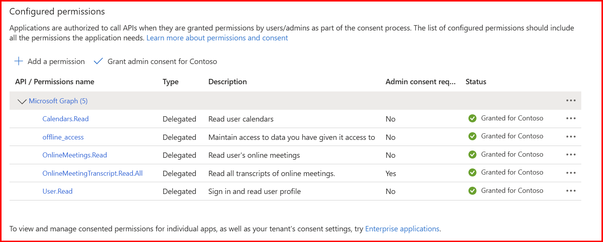
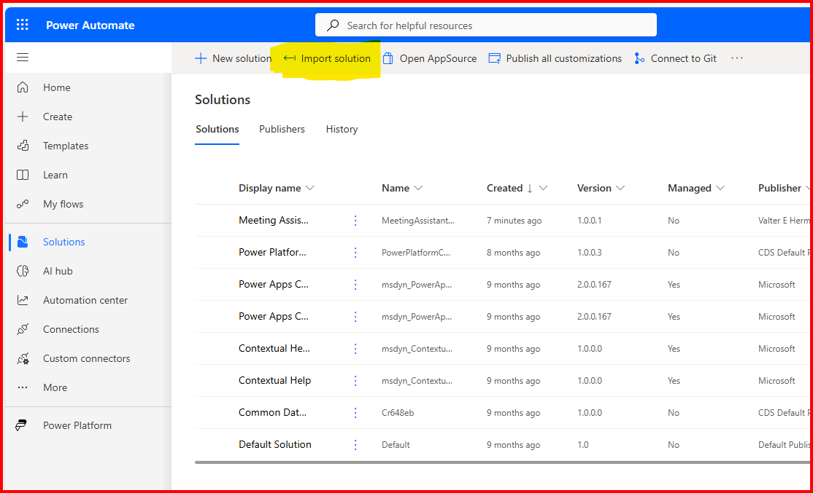
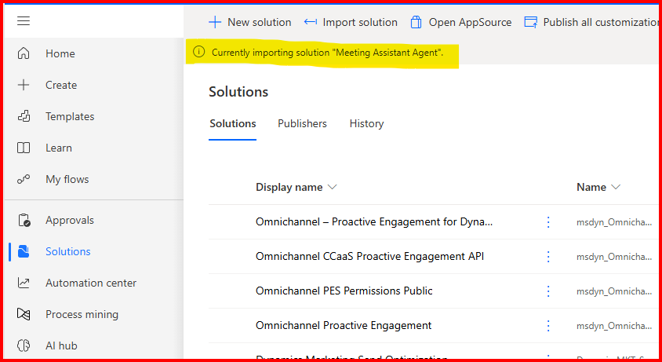
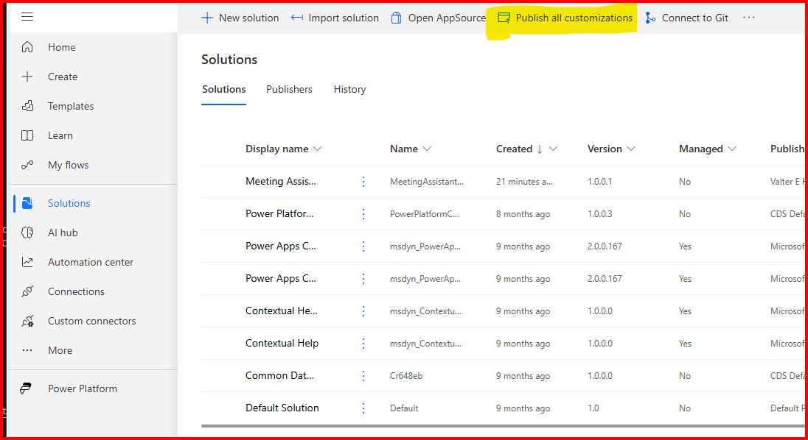
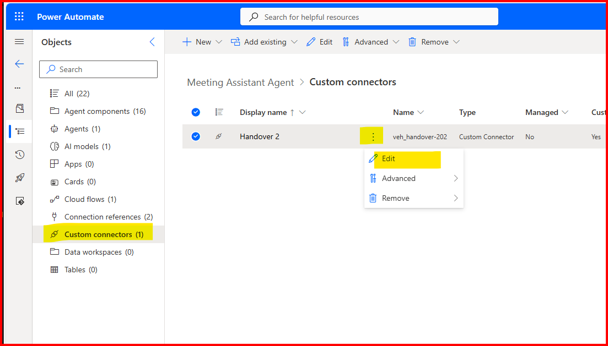
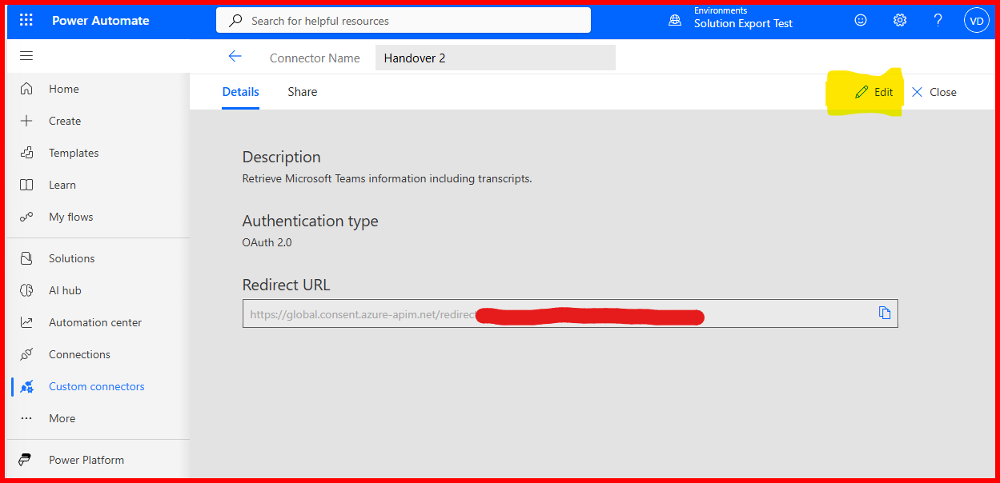

# Installation Guide

## Table of Contents
- [Solution Overview](../#overview)
- [Requirements for Installation](requirements-for-installation.md) 
- [Installation Guide](installation-guide.md)
- [How To Use This Agent](how-to-use-this-agent.md)

### Create an App Registration in Azure
First create an app registration in Azure.

1. Navigate to portal.azure.com
2. From the search bar, type "App Registrations" and click on the result.
3. Click on "New Registration"
4. For the "The user-facing display name for this application (this can be changed later)." , type in "Meeting Assistant Agent Registration". Leave the rest of the default items and click "Register".
5. Click on "Certificates and secrets"
6. Click "New client secret"
7. For Description enter "Meeting Assistant Agent". For Expires select "730 days".
8. From the resulting created secret, copy and paste to a notepad the "Value". Do NOT copy the "Secret ID".
9. From the left-menu click "API Permissions". Click "Add a permission". Click "Microsoft Graph". Click "Delegated permissions". 
10. In "Select permissions", type in Calendars.Read, select the entry and click "Add permissions".
11. Repeat the for the following:
- offline_access
- OnlineMeetings.Read
- OnlineMeetingTranscript.Read.All
12. Make sure to "Grand admin consent" for each item. The result should look like below:

### Download the Solution
Download the solution from the latest release: https://github.com/v7herman4/Meeting-Assistant-Agent/releases

Make sure the download the file matching "MeetingAssistantAgent_x_x_x_x.zip"

### Import the Solution
In a Power Platform compatible browser where you are signed in to your work account, navigate to make.powerautomate.com

Select the file "MeetingAssistantAgent_x_x_x_x.zip" from the location where you've downloaded it and click through the UI until the import beings.

Wait until the banner at the top of the page notes that the solution has finished importing.

Click "Publish All Customizations". This step is mandatory.

Once "Publishing all customizations" completes, edit the custom connector.

### Edit the Custom Connector

Click the "Meeting Assistant Agent" solution to open the solution.
Click "Custom connectors (1)", click the triple-dots next to "Handover 2" and click "edit".

Click on "Edit" to ddit the connector configuration

